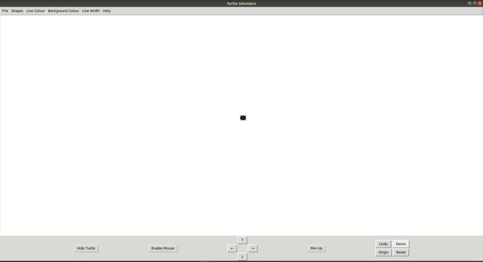
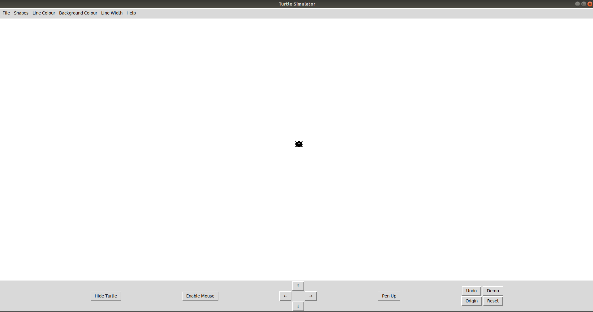

# Turtle-Simulator

## Introduction

Turtle Simulator is a small educational program that allows users to control a turtle to draw shapes on the screen using simple commands. It's designed to be an interactive and fun way to draw shapes and move a turtle around a Graphical User Interface. The turtle can draw basic shapes like triangles, squares, rectangles, circles, and polygons(Pentagon, Hexagon, Heptagon, Octagon and Nonagon). Users can draw shapes they want from the shapes option in the Menubar. Users can control the turtle using either the arrow keys on the screen or the keyboard. The turtle is capable of drawing lines as it moves, which can be toggled on or off, and the turtle icon itself can be hidden. Additionally, users can customize the colour and width of the lines drawn by the turtle.




## Repository Structure
```
Turtle-Simulator                                
├── media                                         
│   ├── 1_IntroDemo.gif                        
│   ├── 2_running_the_simulator.png
│   ├──
├── src                    
│   ├── create_buttons.py
│   ├── create_menubar.py               
│   ├── main.py
│   ├── shapes.py
│   ├── turtle_navigation.py                  
│   ├── turtle_simulator.py
│   ├── turtle_simulator_UI.py                           
├── .gitignore                 
├── README.md                   
└──   
```


## Table of Contents

- [Installation](#installation)
- [Usage](#usage)
- [Features](#features)
- [Dependencies](#dependencies)
- [Configuration](#configuration)
- [Documentation](#documentation)
- [Examples](#examples)
- [Troubleshooting](#troubleshooting)
- [Contributors](#contributors)
- [License](#license)


## Dependencies

### Dependencies for Running Locally

To run the project, you should have the following installed

* python  >= 3.8 
    * All Operating Systems: [click here for installation instructions](https://www.python.org/downloads/)
* tkinter >= 8.6
    * Note tkinter should be included by default when installing python. however for some operating systems(for example ubuntu), you may have to install specifically. Instruction on how to install is given below
    * All Operating System: [click here for installation instructions](https://tkdocs.com/tutorial/install.html#install-win-python) 
* Pillow == 8.4.0
    * All Operating Systems: [Click here for Installation instructions](https://pillow.readthedocs.io/en/stable/installation.html)

* json == 2.0.9
    * Already Installed by default when installing python
 
### Running The Project

To run the project, clone the project into a directory where you want to run it by running the below command in your terminal

```bash
git clone https://github.com/abdulbaasitt/Turtle-Simulator.git
```
Then change directory to the directory where main.py is located
```bash
cd ~/Turtle-Simulator/src
```
In the same terminal, run 
```bash 
python3 main.py
```

You should see The Turtle Simulator User Interface pop up on your screen as shown below




### Running in a conda environment
 To run this project in a conda environment, you'll have to have conda installed. You can install conda by following this [link](https://docs.conda.io/projects/conda/en/latest/user-guide/install/index.html)

 Once conda is installed, follow the below instructions to run the run the project

 1. **Create A Conda Environment**
 
* Create a conda environment using the command below
    ```bash
    conda create -n turtlesimulatorenv python=3.8
    ```
 2. **Activate the Conda Environment:**

 * Once the environment is created, activate it with the command:
    ```bash
    conda activate turtlesimulatorenv 
    ```
 3. **Install Tkinter:**
    
* Tkinter should be included by default in Python. However, if it's not present, you can install it in your Conda environment.
    ```bash
    conda install -c anaconda tk
    ```
 4. **Install Pillow:**
        
* Install Pillow (Python Imaging Library) by running the command
    ```bash
    pip install Pillow==8.4.0
    ```
 5. JSON Module is already installed as part of the python standard library

 6.**Verify Installations:**
 
 * Verify the installations by running

    ```bash
    python -m tkinter -c "print(tkinter.TkVersion)"
    python -c "import PIL; print(PIL.__version__)"
    ```

* click Quit from the window that pops up

 7. **Running the Project:** 
 
* With all the dependencies installed, you can run the project following the instruction to [run the project](#running-the-project) above


## Installation

To run the Turtle Simulator, navigate to the `src` directory and execute the following command:

```bash
python3 main.py
```

## Usage

* Control of a turtle for drawing basic geometric shapes.

* Ability to draw lines while the turtle moves, with a toggle feature for the pen.

* Customization of line color and width.

* Capability to hide the turtle icon.

* Interaction through both on-screen and keyboard controls.

## File Description

### Create Button 

### Create Menubar

### Turtle Simulator UI

### Shapes

### Turtle Navigation

### Turtle Simulator

### Main


## Features
### Demo 

### Drawing Different Shapes

### Moving Around the Canvas

### keyboard Shortcuts


## Examples


## Troubleshooting


## Contributors


## License

