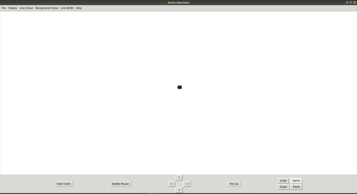

# Turtle-Simulator

## Introduction

Turtle Simulator is a small educational program that allows users to control a turtle to draw shapes on the screen using simple commands. It's designed to be an interactive and fun way to learn basic programming and graphical concepts. The turtle can draw basic shapes like triangles, squares, rectangles, circles, and polygons. Users can control the turtle using either the arrow keys on the screen or the keyboard. The turtle is capable of drawing lines as it moves, which can be toggled on or off, and the turtle icon itself can be hidden. Additionally, users can customize the colour and width of the lines drawn by the turtle.




## Repository Structure
<!-- Turtle-Simulator/
├── Assets/
│   └── IntroDemo.gif

└── README.md -->


## Table of Contents

- [Installation](#installation)
- [Usage](#usage)
- [Features](#features)
- [Dependencies](#dependencies)
- [Configuration](#configuration)
- [Documentation](#documentation)
- [Examples](#examples)
- [Troubleshooting](#troubleshooting)
- [Contributors](#contributors)
- [License](#license)


## Dependencies
tkinter
PIL (Python Imaging Library)

## Running Locally 


## Running in a conda environment

## Installation

To run the Turtle Simulator, navigate to the `src` directory and execute the following command:

```bash
python3 main.py
```

## Usage

* Control of a turtle for drawing basic geometric shapes.

* Ability to draw lines while the turtle moves, with a toggle feature for the pen.

* Customization of line color and width.

* Capability to hide the turtle icon.

* Interaction through both on-screen and keyboard controls.

## File Description

### Create Button 

### Create Menubar

### Turtle Simulator UI

### Shapes

### Turtle Navigation

### Turtle Simulator

### Main


## Features
### Demo 

### Drawing Different Shapes

### Moving Around the Canvas

### keyboard Shortcuts


## Examples


## Troubleshooting


## Contributors


## License

