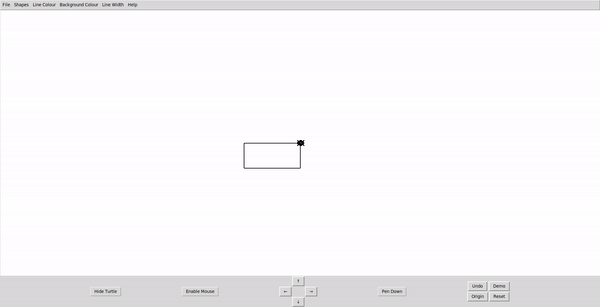
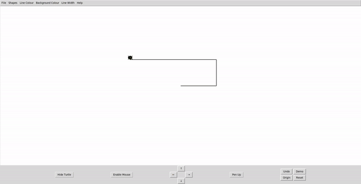
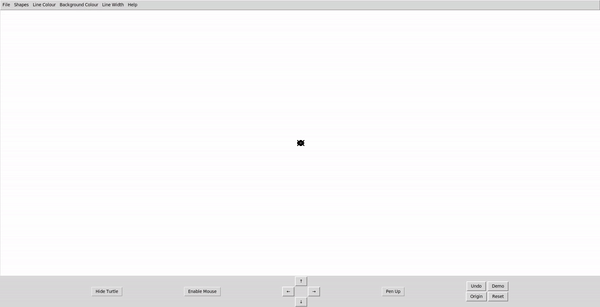
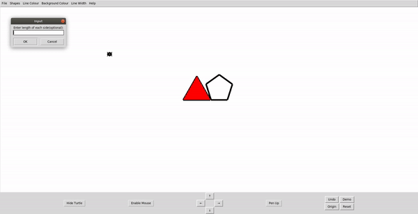

# Turtle-Simulator

## Introduction

Turtle Simulator is a small educational program that allows users to control a turtle to draw shapes on the screen using simple commands. It's designed to be an interactive and fun way to draw shapes and move a turtle around a Graphical User Interface. The turtle can draw basic shapes like triangles, squares, rectangles, circles, and polygons(Pentagon, Hexagon, Heptagon, Octagon and Nonagon). Users can draw shapes they want from the shapes option in the Menubar. Users can control the turtle using either the arrow keys on the screen or the keyboard. The turtle is capable of drawing lines as it moves, which can be toggled on or off, and the turtle icon itself can be hidden. Additionally, users can customize the colour and width of the lines drawn by the turtle.


## Repository Structure
```
Turtle-Simulator                                
├── media                                         
│   ├── 1_IntroDemo.gif                        
│   ├── 2_running_the_simulator.png
│   ├── 4_drawing_lines_while_turtle_moves.gif
│   ├── 6_changing_line_colour_and_width.gif
│   ├── 8_drawing_different_shapes_1.gif
│   ├── 8_drawing_different_shapes_2.gif
├── src                    
│   ├── create_buttons.py
│   ├── create_menubar.py               
│   ├── main.py
│   ├── shapes.py
│   ├── turtle_navigation.py                  
│   ├── turtle_simulator.py
│   ├── turtle_simulator_UI.py                           
├── .gitignore                 
├── README.md                   
└──   
```


## Table of Contents

- [Dependencies](#dependencies)
- [Running The Project](#running-the-project)
- [Running in a conda environment](#running-in-a-conda-environment)
- [File Description](#file-description)
- [Usage, Features and Demos](#usage-features-and-demo)
- [Keyboard Shortcuts](#keyboard-shortcuts)
- [Notes](#notes)
- [License](#license)


## Dependencies

### Dependencies for Running Locally

To run the project, you should have the following installed following softwares and packages

* python  >= 3.8 
    * All Operating Systems: [click here for installation instructions](https://www.python.org/downloads/)
* tkinter >= 8.6
    * Note tkinter should be included by default when installing python. however for some operating systems(for example ubuntu), you may have to install specifically. Instruction on how to install is given below
    * All Operating System: [click here for installation instructions](https://tkdocs.com/tutorial/install.html#install-win-python) 
* Pillow == 8.4.0
    * All Operating Systems: [Click here for Installation instructions](https://pillow.readthedocs.io/en/stable/installation.html)

* json == 2.0.9
    * Already Installed by default when installing python
 
## Running The Project

To run the project, clone the project into a directory where you want to run it by running the below command in your terminal

```bash
git clone https://github.com/abdulbaasitt/Turtle-Simulator.git
```
Then navigate to the `src` directory where `main.py` is located using the following command change directory
```bash
cd ~/Turtle-Simulator/src
```
In the same terminal, execute the following command to run the simulator 
```bash 
python3 main.py
```

You should see The Turtle Simulator User Interface pop up on your screen as shown below


## Running in a Conda Environment
 To run this project in a conda environment, you'll have to have conda installed. You can install conda by following this [link](https://docs.conda.io/projects/conda/en/latest/user-guide/install/index.html)

 Once conda is installed, follow the below instructions to run the run the project

 1. **Create A Conda Environment**
 
* Create a conda environment using the command below
    ```bash
    conda create -n turtlesimulatorenv python=3.8
    ```
 2. **Activate the Conda Environment:**

 * Once the environment is created, activate it with the command:
    ```bash
    conda activate turtlesimulatorenv 
    ```
 3. **Install Tkinter:**
    
* Tkinter should be included by default in Python. However, if it's not present, you can install it in your Conda environment.
    ```bash
    conda install -c anaconda tk
    ```
 4. **Install Pillow:**
        
* Install Pillow (Python Imaging Library) by running the command
    ```bash
    pip install Pillow==8.4.0
    ```
 5. JSON Module is already installed as part of the python standard library

 6.**Verify Installations:**
 
 * Verify the installations by running

    ```bash
    python -m tkinter -c "print(tkinter.TkVersion)"
    python -c "import PIL; print(PIL.__version__)"
    ```

* click Quit from the window that pops up

 7. **Running the Project:** 
 
* With all the dependencies installed, you can run the project following the instruction to [run the project](#running-the-project) above


## File Description

The code has been separated to different files for easy readability and maintainability. The files are described below

### Shapes

The `Shapes` class in [`shapes.py`](https://github.com/abdulbaasitt/Turtle-Simulator/blob/main/src/shapes.py) is a helper class used in the `TurtleSimulator` class for drawing and filling different shapes.It also contains functions that creates the animation while drawing by using a timer to draw the shapes in small steps. 


### Turtle Navigation

The `TurtleNavigation` class in [`turtle_navigation.py`](https://github.com/abdulbaasitt/Turtle-Simulator/blob/main/src/turtle_navigation.py) is a helper class used in the `TurtleSimulator` class for moving the turtle around the canvas. It contains functions to move the turtle forward, backward, left and right. It also contains functions to move the turtle to a specific location on the canvas and to move the turtle to the origin and ensures the turtle does not move outside the canvas area. 


### Turtle Simulator

The `TurtleSimulator` class in [`turtle_simulator.py`](https://github.com/abdulbaasitt/Turtle-Simulator/blob/main/src/turtle_simulator.py) is the main class responsible for handling the internal states of the turtle. It contains functions to  set the state of the turtle pen, create and update the turtle icon, tracks the turtle position and heading, tracks the turtle pen colour and width and tracks the turtle visibility. It also contains functions to clear or reset the canvas and keeps track of the turtle's movement history which is used for the undo function.


### Create Button

The `CreateButtons` class in [`create_buttons.py`](https://github.com/abdulbaasitt/Turtle-Simulator/blob/main/src/create_buttons.py) is a helper class used in the `TurtleSimulatorUI` class for handling and managing various buttons in the Turtle Simulator. The class offers a range of buttons from directional buttons to control movement on the canvas to functional buttons like reset, undo, demo and origin to toggle buttons like pen up/down and enable/disable mouse click


### Create Menubar

The `CreateMenuBar` class in [`create_menubar.py`](https://github.com/abdulbaasitt/Turtle-Simulator/blob/main/src/create_menubar.py) is a helper class used in `TurtleSimulatorUI` class for creating a comprehensive and intuitive menu bar. The menu bar has the functionalities for creating new canvas, saving a canva, drawing different shapes, changing the colour and width of the line draw by the turtle, changing the background colour of the canvas.


### Turtle Simulator UI

The `TurtleSimulatorUI` class in [`turtle_simulator_UI.py`](https://github.com/abdulbaasitt/Turtle-Simulator/blob/main/src/turtle_simulator_UI.py) is the main class that handles the user interface of the turtle simulator. It is the class that is called when the program is started and it is responsible for creating the canvas, the turtle, the buttons and the menu bar. It also handles the logic for all the buttons, the menu bar, keyboard and mouse functionality and the demo function.

 <!-- It inherits from the "CreateButtons" and "CreateMenuBar" classes. It uses methods from the turtle_simulator.py class to draw the shapes and move the turtle around the canvas. -->

### Main

The `main` function in [`main.py`](https://github.com/abdulbaasitt/Turtle-Simulator/blob/main/src/main.py) is the main function that is called when the program is started. It creates an instance of the `TurtleSimulatorUI` class and runs the mainloop function(run function in TurtleSimulatorUI class) to start the program.


## Usage, Features and Demo

In this section, we will go through the different features and of the Turtle Simulator

### Drawing lines while the turtle moves, with a toggle feature for the pen.




### Changing Line Colour, Background Colour and Line Width



### Drawing different shapes and  hiding the turtle icon.






## keyboard Shortcuts

The following keyboard shortcuts are available for the Turtle Simulator

| Functionality | Shortcut | 
|----------     |----------|
|      Move Up         |    ↑      |
|      Move Down         |    ↓      |
|      Move Left         |    ←      |
|      Move Right         |    →      |
|      set line colour black         |   b       |
|      set line colour red         |      r    |
|      set line colour green         |    g      | 
|      set line colour orange         |    o      | 
|      set line colour purple         |     p     | 
|      set line colour yellow         |    y      | 
|      set line colour blue         |       l   | 
|      set pen up          |    u      | 
|      set pen down          |   d       | 
|      set line width         |  1 to 10        | 
| Quit while demo is running      |    q      |

## Notes

The Undo button is only works for lines drawn and lines around the shape. It does not work when trying to remove a shape filled with colour. This is because the undo function only keeps track of the turtle's movement history and not the shapes drawn on the canvas.


## License
MIT License

Copyright (c) Abdulbaasit Sanusi

Permission is hereby granted, free of charge, to any person obtaining a copy
of this software and associated documentation files (the "Software"), to deal
in the Software without restriction, including without limitation the rights
to use, copy, modify, merge, publish, distribute, sublicense, and/or sell
copies of the Software, and to permit persons to whom the Software is
furnished to do so, subject to the following conditions:

The above copyright notice and this permission notice shall be included in all
copies or substantial portions of the Software.

THE SOFTWARE IS PROVIDED "AS IS", WITHOUT WARRANTY OF ANY KIND, EXPRESS OR
IMPLIED, INCLUDING BUT NOT LIMITED TO THE WARRANTIES OF MERCHANTABILITY,
FITNESS FOR A PARTICULAR PURPOSE AND NONINFRINGEMENT. IN NO EVENT SHALL THE
AUTHORS OR COPYRIGHT HOLDERS BE LIABLE FOR ANY CLAIM, DAMAGES OR OTHER
LIABILITY, WHETHER IN AN ACTION OF CONTRACT, TORT OR OTHERWISE, ARISING FROM,
OUT OF OR IN CONNECTION WITH THE SOFTWARE OR THE USE OR OTHER DEALINGS IN THE
SOFTWARE.

